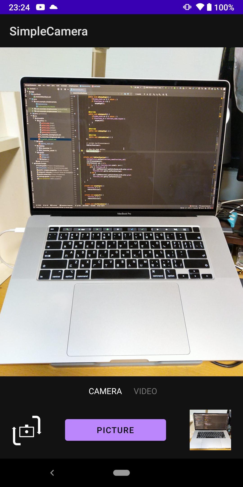
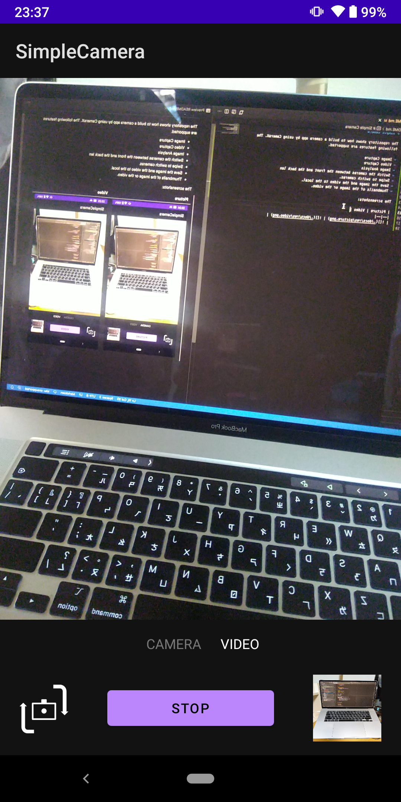

# Simple Camera

The repository shows how to build a camera app by using CameraX. The following features are supported.

- Image Capture
- Video Capture
- Image Analysis
- Switch the cameras between the front and the back len.
- Swipe to switch cameras.
- Save the image and the video to the local.
- Thumbnails of the image or the video.

The screenshots:

| Picture | Video |
|--|--|
|  |  |
